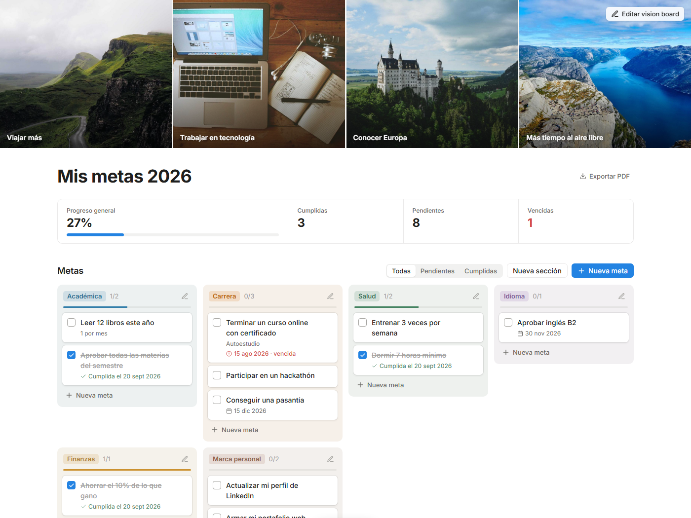

# Mis metas

Página para organizar tus metas del año por secciones, marcar las que cumples y armar tu vision board. Tiene un estilo limpio, inspirado en Notion.

**Pruébala aquí:** https://niurkavane11.github.io/mis-metas/



## Qué puedes hacer

- **Tablero por secciones:** Académica, Carrera, Salud, Idioma, Finanzas… Puedes crear, renombrar, cambiar el color o eliminar secciones.
- **Metas:** agrégalas, edítalas (haz clic en la meta), elimínalas o márcalas como cumplidas. Cada meta puede tener una nota y una fecha límite, y avisa cuando está vencida.
- **Progreso:** resumen con el porcentaje general, cumplidas, pendientes y vencidas, además de una barra de progreso por sección.
- **Vision board:** sube imágenes que te inspiren y aparecen como portada, cada una con su frase. También puedes arrastrarlas a la página.
- **Deshacer:** si eliminas algo por error, puedes recuperarlo desde el aviso que aparece abajo.
- **Exportar PDF:** guarda tu tablero como PDF para imprimirlo o compartirlo.
- **Filtros:** ver todas, solo pendientes o solo cumplidas.
- Funciona en computadora y celular, con modo oscuro automático.

## Dónde se guardan tus datos

Todo se guarda **en tu navegador** (localStorage). No hay cuentas ni servidor, y nadie más puede ver tus metas.

Ten en cuenta que:

- Tus metas solo están en el navegador y el dispositivo donde las creaste.
- Si borras los datos de navegación, se pierden. Usa **Exportar PDF** para tener una copia.

## Usarla en tu computadora

No necesita instalar nada. Descarga `index.html` y ábrelo en el navegador.

```bash
git clone https://github.com/NiurkaVane11/mis-metas.git
```

## Tecnología

HTML, CSS y JavaScript en un solo archivo, sin librerías ni dependencias. Tipografía [Inter](https://fonts.google.com/specimen/Inter).

Las imágenes de la captura son de [Unsplash](https://unsplash.com), vía [Lorem Picsum](https://picsum.photos).
